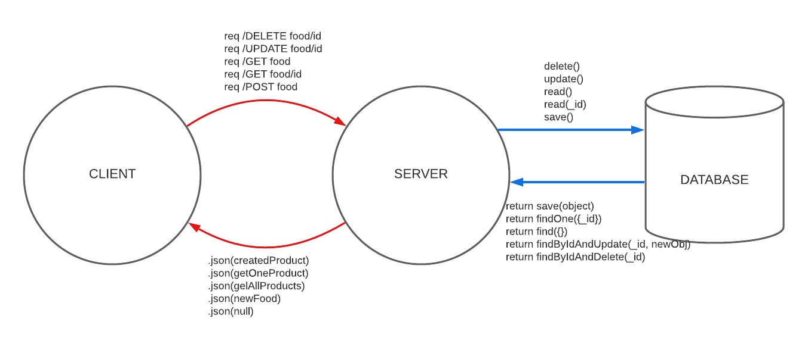

# LAB - Class 04  

## Project: API Server 

### Author: Yuliya Barysevich

### Links and Resources

1. Deployed with Heroku (2 routes)

    - [https://barysevich-api-server.herokuapp.com/](https://barysevich-api-server.herokuapp.com/)

2. Github URLs

    - [https://github.com/YuliyaBarysevich/api-server/runs/2417056780](https://github.com/YuliyaBarysevich/api-server/runs/2417056780)
    - [https://github.com/YuliyaBarysevich/api-server/pull/1](https://github.com/YuliyaBarysevich/api-server/pull/1)
  

### Setup

- **.env requirements** 
i.e.
  - PORT - Port Number

### How to initialize/run your application

- Download all dependencies `npm install`
- Create **.env** file and assign **PORT** variable to 3000
- Run command `nodemon` in terminal to start app on localhost:3333
- To run tests, run command `npm run test` in terminal

### Tests

- 404 on a bad route
- 404 on a bad method
- 500 errors handler

### WRRC

